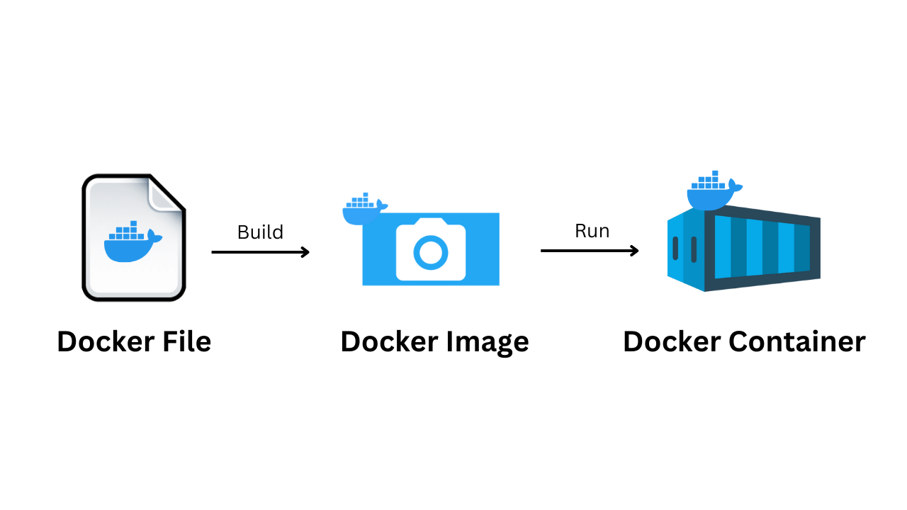
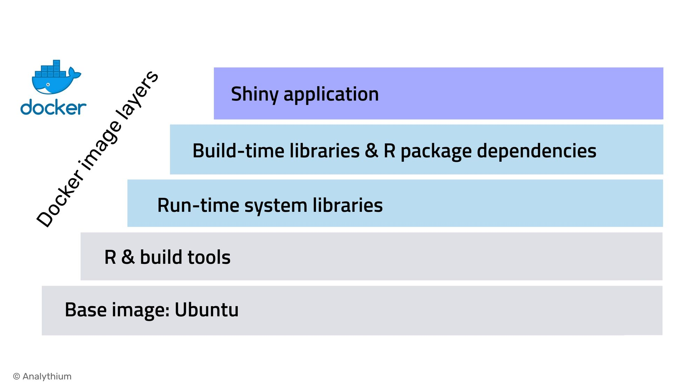

# Containers vs Images

One of the most important concepts in Docker is understanding the difference between **images** and **containers**. If you confuse these two, everything becomes complicated. Let's make it crystal clear.

---

## The Simple Analogy

Think of it like a **recipe and a cooked meal**:

- **Image** = Recipe (blueprint, instructions, ingredients list)
- **Container** = Cooked meal (actual food on your plate, running)

You don't eat a recipe. You follow the recipe to make the actual meal. Same with Docker.

---

## Visual Comparison



---

## What is a Docker Image?

A **Docker image** is a **blueprint** or **template** – it's the recipe for your application.

### Image Properties:

- ✓ **Read-only** – You can't change it after it's built
- ✓ **Portable** – The exact same file everywhere
- ✓ **Lightweight** – Just code and dependencies (no OS kernel)
- ✓ **Reusable** – Create one image, run many containers from it

### What's Inside an Image?

```
My App Image
├── Base OS layer (e.g., Ubuntu, Alpine)
├── Runtime (e.g., Node.js, Python)
├── Application code
├── Dependencies & libraries
└── Configuration & environment
```

---

## Understanding Docker Image Layers

Docker images are built in **layers** – think of it like a **stack of pancakes** or **cake with frosting**.

### What are Layers?

Each layer is a **snapshot** of changes to the filesystem. When you build an image, Docker creates multiple layers that stack on top of each other to form the complete image.

### Visual Example: Shiny Application Image



Looking at this real-world example, a Shiny application (R web app) image has:

1. **Base image: Ubuntu** (bottom) – The foundation OS
2. **R & build tools** – Compiler and tools needed to build
3. **Run-time system libraries** – Libraries needed to run the app
4. **Build-time libraries & R package dependencies** – All R packages installed
5. **Shiny application** (top) – Your actual code

### How Layers Work

**Building Process:**

```
Layer 1: Start with Ubuntu base image
       ↓
Layer 2: Add R & build tools
       ↓
Layer 3: Add system libraries
       ↓
Layer 4: Add R packages
       ↓
Layer 5: Add your application code
       = Complete Docker Image
```

Each layer is **read-only** once created. When you run a container, Docker adds one more **writable layer** on top where changes are stored.

### Why Layers Matter

**1. Efficiency & Reusability**

- If you have 10 apps that all use Ubuntu + R, they share the same base layer
- No duplication – just references to the same layer
- Saves disk space

**2. Caching**

- If Layer 1 and Layer 2 haven't changed, Docker uses them from cache
- Only rebuilds layers that changed
- Much faster builds

**3. Incremental Updates**

- Update just the top layer (your code) without rebuilding everything below
- Old layers stay the same

### Layer Example in Code

When you write a Dockerfile (will cover later):

```dockerfile
FROM ubuntu:20.04          # Layer 1: Base image
RUN apt-get install r      # Layer 2: Install R
COPY packages.R .          # Layer 3: Copy dependency file
RUN Rscript packages.R     # Layer 4: Install R packages
COPY app.R .               # Layer 5: Copy application code
CMD ["Rscript", "app.R"]   # Layer 6: Run command
```

**Result**: 6 layers stacked to create one image.

### Container Layer

When you **run a container** from an image, Docker adds one more layer on top:

```
Image layers (read-only)
├── Layer 1: Ubuntu
├── Layer 2: R & tools
├── Layer 3: System libraries
├── Layer 4: R packages
└── Layer 5: Your app code
       ↓
Container layer (writable) ← New files, changes, logs go here
```

You can write files, change configurations, install packages in the container, but the image stays unchanged.

### Example Image: Node.js Web App

```
node-app-image (200 MB)
├── Layer 1: Ubuntu base (50 MB)
├── Layer 2: Node.js runtime (80 MB)
├── Layer 3: npm packages (40 MB)
├── Layer 4: Your JavaScript code (30 MB)
└── Layer 5: Configuration (20 MB)
```

---

## What is a Docker Container?

A **Docker container** is a **running instance** of an image – it's the actual cooked meal.


### Container Properties:

- ✓ **Running process** – Actively executing
- ✓ **Writable** – Has its own file system you can modify
- ✓ **Isolated** – Separate from other containers
- ✓ **Temporary** – Can be created and destroyed instantly

### What a Container Does:

```
Running container from node-app-image
├── Isolated filesystem
├── Running Node.js process
├── Your app responding to requests
└── Isolated network (port 3000)
```

---

## The Key Difference: Side by Side

| Aspect                     | Image                       | Container                      |
| -------------------------- | --------------------------- | ------------------------------ |
| **What is it?**            | Blueprint/Template          | Running instance               |
| **Can you modify it?**     | No (read-only)              | Yes (has writable layer)       |
| **Exists as**              | File on disk                | Running process in memory      |
| **How many can you have?** | One image → many containers | Each is independent            |
| **Size**                   | Smaller (stored)            | Slightly larger (has state)    |
| **Creation**               | Built once                  | Created/destroyed instantly    |
| **Persistence**            | Stays on disk               | Dies when stopped (by default) |

---

## Real-World Example: Cookie Cutter

Imagine you have a **cookie cutter**:

### The Image = Cookie Cutter

```
Cookie Cutter Template
├── Shape: Star
├── Size: 5cm
├── Material: Metal (unchanged, reusable)
```

You can use this one cookie cutter to make **100 identical cookies**.

### The Container = Each Baked Cookie

```
Cookie 1        Cookie 2        Cookie 3
├── Star shape  ├── Star shape  ├── Star shape
├── Decorated   ├── Plain       ├── Sprinkles
├── Eaten       ├── In box      ├── On display
```

Each cookie is:

- Made from the same template (image)
- Unique in its own way (different toppings, different state)
- Can be eaten or discarded (destroyed)

The cookie cutter (image) stays the same forever. The cookies (containers) are temporary.

---
