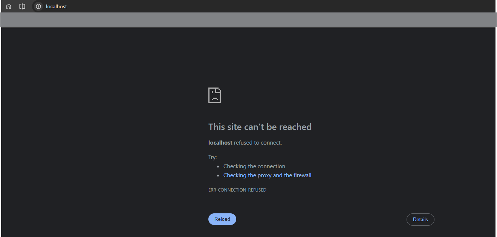
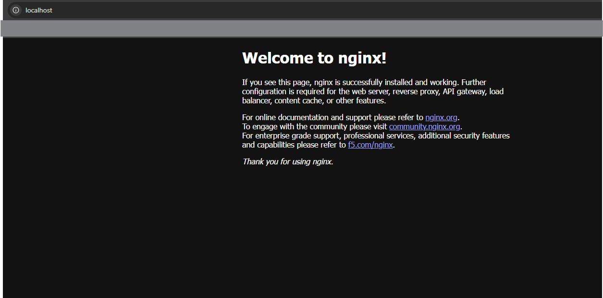

# Run Your First Container

Let's start by running our first container. First, make sure Docker is running:

- **Windows/Mac**: Open Docker Desktop
- **Linux**: Run `sudo systemctl start docker`

Now let's run a simple container named `hello-world` and see what happens.

Run this command:

```
docker run hello-world
```

You'll see this output:

```
Unable to find image 'hello-world:latest' locally
latest: Pulling from library/hello-world
d5e71e642bf5: Download complete
4f55086f7dd0: Pull complete
Digest: sha256:f9078146db2e05e794366b1bfe584a14ea6317f44027d10ef7dad65279026885
Status: Downloaded newer image for hello-world:latest

Hello from Docker!
This message shows that your installation appears to be working correctly.

To generate this message, Docker took the following steps:
 1. The Docker client contacted the Docker daemon.
 2. The Docker daemon pulled the "hello-world" image from the Docker Hub.
    (amd64)
 3. The Docker daemon created a new container from that image which runs the
    executable that produces the output you are currently reading.
 4. The Docker daemon streamed that output to the Docker client, which sent it
    to your terminal.

To try something more ambitious, you can run an Ubuntu container with:
 $ docker run -it ubuntu bash

Share images, automate workflows, and more with a free Docker ID:
 https://hub.docker.com/

For more examples and ideas, visit:
 https://docs.docker.com/get-started/
```

## What Just Happened?

The `docker run` command executes a Docker image (remember, it's like a blueprint). Since we just started Docker and didn't have the image locally, Docker automatically:

1. Pulled the `hello-world` image from Docker Hub
2. Downloaded it to your system
3. Created and ran a container from that image
4. Displayed the output

Behind the scenes, Docker ran: `docker pull hello-world` → `docker run hello-world`

## Downloading Images from Docker Hub

If you want to download an image without running it, you can browse Docker Hub and choose what you need:


### Example: Download Nginx Web Server

In your terminal, simply type:

```bash
docker pull nginx
```

This downloads the latest Nginx image:

```
Using default tag: latest
latest: Pulling from library/nginx
054715a6bffa: Pull complete
4a038fd18db1: Pull complete
88d1d984b765: Pull complete
5435b2dcdf5c: Pull complete
448ea5cac5d5: Pull complete
84e114c2bb36: Pull complete
7b5d674621c2: Pull complete
cc0cf959117b: Download complete
3eff0a97d435: Download complete
Digest: sha256:7f0adca1fc6c29c8dc49a2e90037a10ba20dc266baaed0988e9fb4d0d8b85ba0
Status: Downloaded newer image for nginx:latest
docker.io/library/nginx:latest

What's next:
    View a summary of image vulnerabilities and recommendations → docker scout quickview nginx
```

After downloading, run it with:

```bash
docker run nginx
```

If you visit `localhost` in your browser, the server won't respond. Why?



## Exposing Container Ports

By default, Docker containers are **isolated from your host network**. You need to expose ports to access them.

Stop the current container (press `Ctrl+C`) and run:

```bash
docker run -p 80:80 nginx
```

This exposes port 80 from the container to port 80 on your localhost. Now visit `localhost` in your browser and you'll see Nginx running!



## How Port Mapping Works

Think of your container as a separate house with its own network. When you run `docker run -p 80:80 nginx`, you're connecting:

- **Your computer** (Host): Port 80
- **Container**: Port 80

It's like an extension cord connecting your computer's port 80 to the container's port 80.

### Port Mapping Format

```bash
docker run -p [Host_Port]:[Container_Port] [Image_Name]
```

### Examples

```bash
# Host port 8080 → Container port 80
docker run -p 8080:80 nginx

# Host port 3000 → Container port 3000
docker run -p 3000:3000 my-app
```

## Stopping a Container

Press `Ctrl+C` in the terminal to stop the container.
