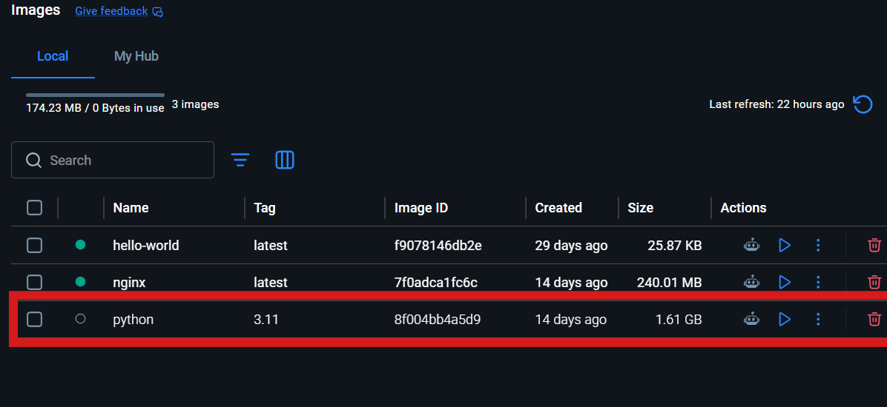
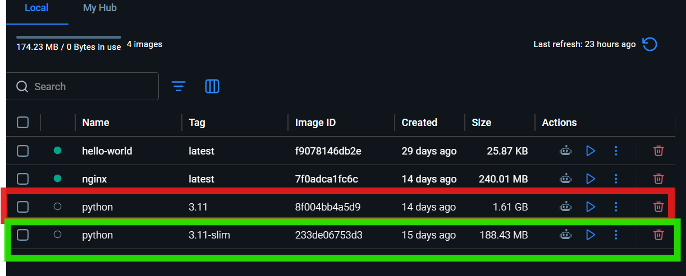
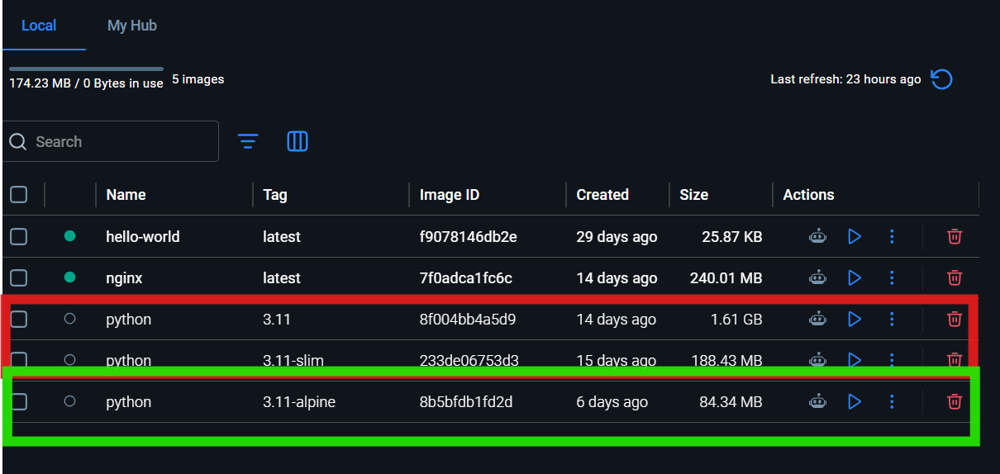
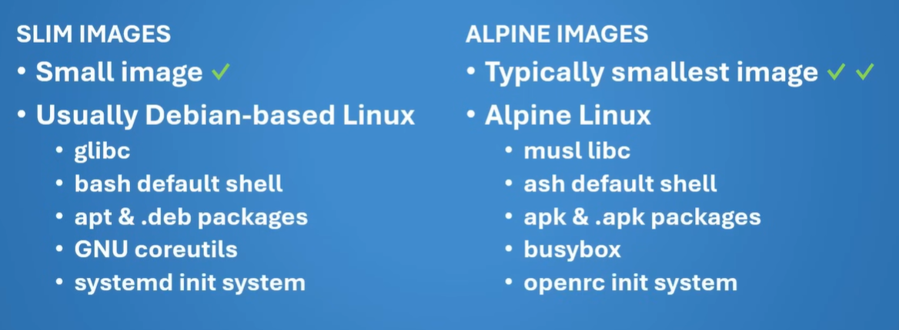

# Slim and Alpine Images

Let's explore one of the most popular Docker images: **Python**.

---

## The Problem: Heavy Images

Let's download Python 3.11:

```bash
docker pull python:3.11
```

When you pull this image, you'll notice it's **1.61 GB** – that's huge! Why?



Because the standard Python image comes with many build tools and development libraries pre-installed. If you only need to **run** Python (not develop), you're wasting disk space and bandwidth.

### Solution: Use Slim Images

Docker provides a `slim` version with only the essentials:

```bash
docker pull python:3.11-slim
```

This drops the image size to just **188 MB** – about 10x smaller!



---

## Even Smaller: Alpine Images

For ultra-minimal images, use Alpine – Linux designed for minimal resource usage:

```bash
docker pull python:3.11-alpine
```

This is only **84 MB**! Alpine includes only the core OS and nothing else.



---

## Comparison: Standard vs Slim vs Alpine

### Size Breakdown

| Version      | Size    | Best For                      |
| ------------ | ------- | ----------------------------- |
| **Standard** | 1.61 GB | Development, complex apps     |
| **Slim**     | 188 MB  | Production apps               |
| **Alpine**   | 84 MB   | Minimal, resource-constrained |

### When to Use Each

**Use Standard Python:3.11**

- You need build tools (gcc, make, etc.)
- You're developing locally
- You need all development dependencies

**Use Python:3.11-slim**

- You only need to **run** Python code (not develop)
- You want a good balance of size and functionality
- This is the most common choice for production

**Use Python:3.11-alpine**

- You need the smallest possible size
- You have low resources (IoT devices, embedded systems)
- You don't mind installing extra tools manually if needed

### Key Differences



**Standard Image:**

- Includes build tools (gcc, make, etc.)
- Includes development headers
- Includes documentation
- **Pro**: Works with most packages out of the box
- **Con**: Very large file size

**Slim Image:**

- Removes build tools and development dependencies
- Keeps runtime libraries
- **Pro**: Much smaller, still works for most use cases
- **Con**: Some packages may need compilation

**Alpine Image:**

- Uses musl libc instead of glibc
- Minimal dependencies
- **Pro**: Extremely small size
- **Con**: Some packages may not work; requires more setup

---

## Practical Example: Building Small Images

### Using Standard Python (Bad for Production)

```bash
docker pull python:3.11
# Results in 1.61 GB image
```

### Using Slim Python (Good for Production)

```bash
docker pull python:3.11-slim
# Results in 188 MB image
# Same functionality, 10x smaller!
```

### Using Alpine Python (Best for Space)

```bash
docker pull python:3.11-alpine
# Results in 84 MB image
# Ultra-minimal, but less flexibility
```

---

## Quick Recommendation

For most production use cases: **Use `-slim` images**.

- ✓ Good balance of size and functionality
- ✓ Most packages work without issues
- ✓ Significantly smaller than standard
- ✓ Not as restricted as Alpine

Only use Alpine if you really need to minimize size, or if you're building for embedded systems.
